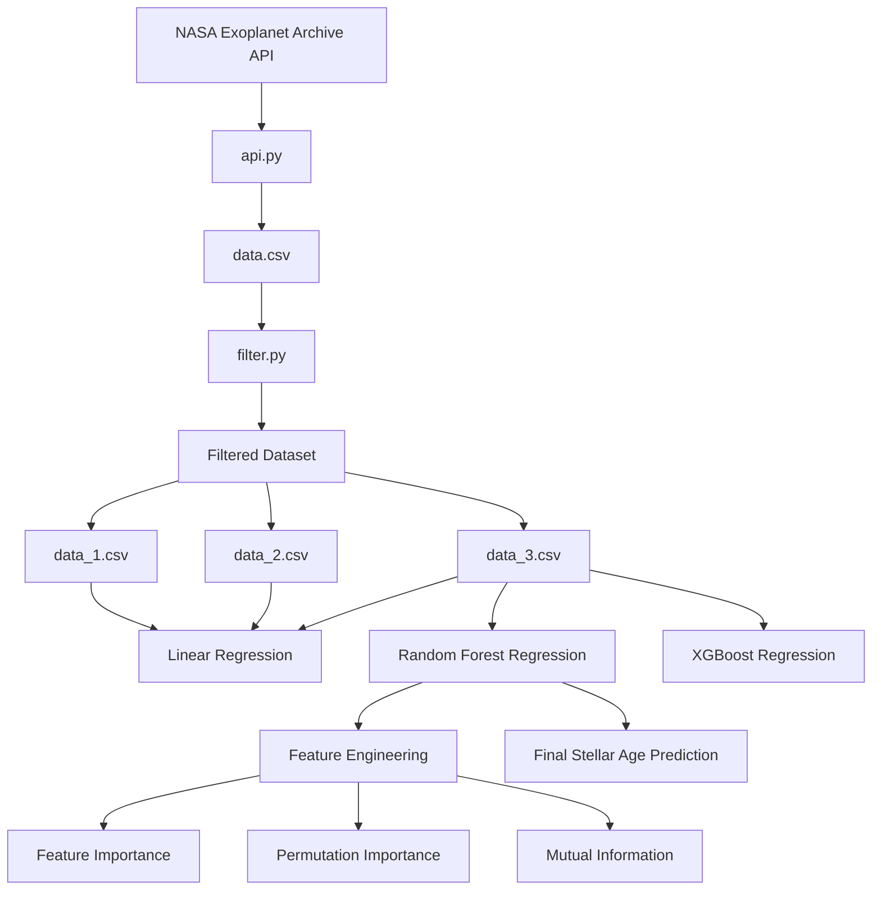

# Predicting Stellar Age from Stellar Parameters using Random Forest Regression

This project predicts stellar age using machine learning regression models trained on stellar parameters collected from the NASA Exoplanet Archive. The project explores statistical analysis, feature engineering, and nonlinear machine learning methods to estimate stellar age from observable stellar properties.

## Project Workflow

## Dataset
The dataset is colleected from NASA Exoplanet Archive API

Collected parameters:
| Parameters | Description |
|------------|-------------|
| pl_name | Planet Name (used for identification) |
| st_teff	| Stellar Effective Temperature |
| st_mass	| Stellar Mass |
| st_lum	| Stellar Luminosity |
| st_rad	| Stellar Radius |
| st_met 	| Stellar Metallicity |
| st_logg | Stellar Surface Gravity |
| st_rotp | Stellar Rotation Period |
| st_age	| Stellar Age |

## Models

### **Linear Regression** 

Three experiments were conducted using different stellar parameter combination to identify the best predictive feature set.

Experiment 1:
`['st_teff', 'st_mass', 'st_lum', 'st_rad', 'st_met', 'st_logg', 'st_rotp']`

Experiment 2:
`['st_teff', 'st_mass', 'st_lum', 'st_rad', 'st_met', 'st_logg']`

Experiment 3:
`['st_teff', 'st_mass', 'st_rad', 'st_met', 'st_logg']`

### **Feature Engineering**

Engineered features:
- mass_rad_ratio

### **Random Forest**

The three Linear Regression experiments were repeated using Random Forest Regression to identify the best feature combination for stellar age prediction.

The final feature set:

`['st_teff', 'st_mass', 'st_rad', 'mass_rad_ratio']`

### **XGBoost**

XGBoost was used to compare predictive performance against Random Forest Regression.

## Result

### Correlation Analysis 
The correlation analysis examined the relationship of stellar paramaters and stellar age using Pearson's correlation analysis and Spearman rank correlation analysis.

| Original Feature | Feature Used | PearsonR | Feature Used | SpearmanR |
|---------|---------|---------|----------|-----------|
| st_mass | mass | -0.308 | mass | -0.321 |
| st_teff | teff | -0.245 | teff | -0.313 |
| st_lum | lum² | -0.123 | lum² | -0.196 |
| st_rad | $log(rad)$ | -0.094 | rad | -0.049 |
| st_met | met | -0.180 | met | -0.161 |
| st_logg | logg³ | 0.062 | logg | 0.012 | 
| st_rotp | $1/rotp$ | -0.371 | $1/rotp^2$ or rotp² | ±0.620 |

Among all analyzed stellar parameters, stellar rotation period (st_rotp) demonstrated the strongest relationship with stellar age, particularly under nonlinear transformation.

### Linear Regression Analysis 
Three Linear Regression models were developed to evaluate the capability of predicting stellar age (st_age) using different sets of independent variables.

| LR Model | $R^2$ score | 
|----------|-------------|
| 1 | 0.318 |
| 2 | -0.143 |
| 3 | 0.225 |

The three Linear Regression models differed only in their selected independent variables. Among them, the first and third models demonstrated the potential to predict stellar age, while the second model showed very poor performance. Based on these findings, the independent variables used in the first and third models were selected for further experimentation using the Random Forest algorithm.

------------
Although stellar rotation period (st_rotp) demonstrated the strongest correlation with stellar age, its inclusion significantly reduced the available dataset to fewer than 300 samples due to missing values. Among the models, the model based on the third Linear Regression feature set achieved the best predictive performance on Random Forest Regression. 

### Final Performance of Random Forest Regression Model
| Metric | Value | 
|--------|-------|
| R² score | 0.8501 |
| MAE | 0.4964 | 
| MSE | 0.9756 |
| RMSE | 0.9866 |

The Random Forest Regression model achieved strong predictive capability for stellar age estimation, explaining approximately 85% of the variance in stellar age. The low MAE and RMSE values indicate relatively small prediction errors, while the slightly higher RMSE compared to MAE suggests the presence of some larger residuals or outliers

### Cross Validation Result
| Metric | Value |
|--------|-------|
| Mean CV R² | 0.8434 |
| CV STD | 0.0190 |

The cross-validation results indicate that the model generalizes consistently well across multiple validation folds. The high Mean CV R² score and low standard deviation suggest stable predictive performance, low variability, and reduced risk of overfitting when applied to unseen stellar data.

### Feature Importance Analysis 
The feature importance analysis of the Random Forest model was used to identify which stellar parameters contributed the most to reducing impurity and variance during stellar age prediction.

| Feature | Importance | 
|---------|------------|
| st_mass | 0.30104 |
| st_teff | 0.27057 |
| mass_rad_ratio | 0.26725 |
| st_rad | 0.16113 |

The analysis showed that stellar mass (st_mass) was the most important feature in predicting stellar age, with a feature importance value of 0.30, followed by stellar effective temperature (st_teff) at 0.27. The ratio of stellar mass to stellar radius also contributed significantly to the model’s predictive performance.

### Permutation Importance Analysis 
Permutation importance measures how much the model performance decreases when the values of a feature are randomly shuffled, indicating the contribution of each variable to stellar age prediction.

| Feature | Importance |
|---------|------------|
| st_mass | 1.32403 |
| mass_rad_ratio | 1.17578 |
| st_teff | 0.54055 |
| st_rad | 0.42848 |

The permutation importance analysis showed that stellar mass caused the largest decrease in model performance when shuffled, with a score of 1.32, indicating that it was the most important feature in predicting stellar age. This was followed by the ratio of stellar mass to stellar radius, which also caused a noticeable performance decline when randomized. Meanwhile, features with scores around 0.5 may contain noisier data, although they still exhibit some relationship with stellar age.

### Mutual Information Analysis 
The mutual information analysis was used to identify which stellar parameters contained the most information related to stellar age prediction. 

| Feature | MI Score |
|---------|----------|
| st_teff | 1.26221 |
| mass_rad_ratio | 1.24738 |
| st_mass | 1.11376 |
| st_rad | 1.09286 |

Unlike the Random Forest feature importance and permutation importance analyses, the results showed that stellar effective temperature (st_teff) and the ratio of stellar mass to stellar radius contained more information about stellar age than stellar mass itself.

-----------

This project was created from personal interest in astrophysics and machine learning. The project was designed to be partially beginner-friendly, although unexpected errors may still occur during execution or preprocessing. Huge thanks to NASA Exoplanet Archive that made this project possible.

--------
by Jim 🫶
