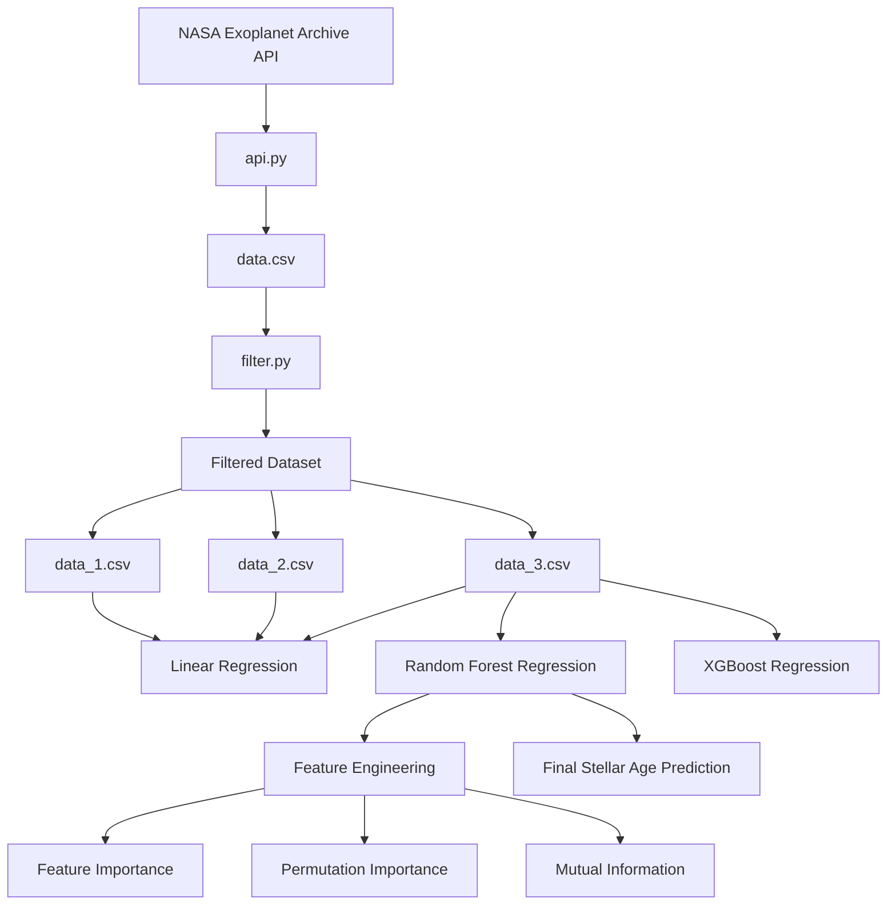

# Predicting Stellar Age from Stellar Parameters using Random Forest Regression

This project predicts stellar age using machine learning regression models trained on stellar parameters collected from the NASA Exoplanet Archive. The project explores statistical analysis, feature engineering, and nonlinear machine learning methods to estimate stellar age from observable stellar properties.

## Project Workflow

## Dataset
The dataset is colleected from NASA Exoplanet Archive API

Collected parameters:
| Parameters | Description |
|------------|-------------|
| pl_name | Planet Name (used for identification) |
| st_teff	| Stellar Effective Temperature |
| st_mass	| Stellar Mass |
| st_lum	| Stellar Luminosity |
| st_rad	| Stellar Radius |
| st_met 	| Stellar Metallicity |
| st_logg | Stellar Surface Gravity |
| st_rotp | Stellar Rotation Period |
| st_age	| Stellar Age |

## Models

**Linear Regression** 
Three experiments were conducted using different stellar parameter combination to identify the best predictive feature set.

Experiment 1:
`['st_teff', 'st_mass', 'st_lum', 'st_rad', 'st_met', 'st_logg', 'st_rotp']`

Experiment 2:
`['st_teff', 'st_mass', 'st_lum', 'st_rad', 'st_met', 'st_logg']`

Experiment 3:
`['st_teff', 'st_mass', 'st_rad', 'st_met', 'st_logg']`
